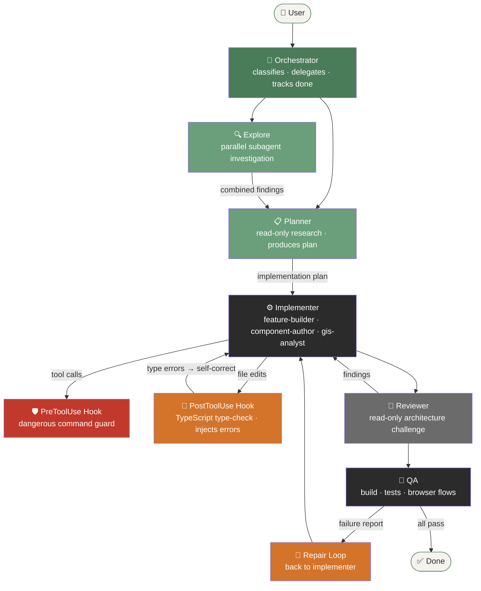

# blipmap Agent System

> A practical reference implementation of modern agentic software engineering.

This document explains the architecture of blipmap's AI development system — not merely where the files live, but **why each layer exists** and how the pieces cooperate to make agents that plan, act, observe, correct, verify, and finish work.

---

## Why This Exists

A language model that writes code is useful. An agentic system that can *understand, delegate, observe, correct, and verify* is something more.

This repository is designed to make the difference between those two things tangible. Every mechanism here has a concrete engineering responsibility. Nothing was added to make the configuration list look impressive.

---

## Architecture Overview



---

## Context Architecture

One of the most important ideas in this system is that **context is routed, not broadcast**. Not every agent needs to know everything. Loading irrelevant knowledge wastes context window and dilutes attention.

```
LAYER 1 — Global (always present)
  .github/copilot-instructions.md
  Loaded for every interaction. Contains only what matters for every task:
  stack constraints, data model, key file locations, agent roster.

LAYER 2 — Scoped (loaded when matching files are in context)
  .github/instructions/*.instructions.md
  react-components.instructions.md  → only when src/components/react/** is touched
  web-components.instructions.md    → only when src/components/web/** is touched
  gis-functions.instructions.md     → only when src/gis/** is touched
  data-layer.instructions.md        → only when src/data/** is touched

LAYER 3 — Capability (loaded when the agent recognizes the need)
  .github/skills/*/SKILL.md
  blipmap-patch-schema    → schema changes, migrations, seed data
  blipmap-web-components  → Lit component authoring
  blipmap-gis-ops         → Turf.js spatial operations
  blipmap-design-system   → CSS tokens, microcopy, visual language
  maplibre-rendering      → MapLibre sources, layers, markers, events
  browser-qa              → browser verification workflow

LAYER 4 — Task (the current session plan)
  Produced by the planner, consumed by the implementer.
  Exists only for the duration of a task.

LAYER 5 — Discovered Durable Knowledge
  /memories/repo/blipmap.md
  Facts agents discover that are not in source documentation:
  runtime quirks, performance observations, environment dependencies.
```

The architecture ensures that an agent working on a single GIS function loads Turf patterns but not MapLibre layer management. An agent touching a React panel loads React conventions but not Web Component authoring rules.

---

## Agents and Responsibilities

### Orchestrator
**File:** `.github/agents/orchestrator.agent.md`
**Tools:** `read`, `search`, `agent`

The coordinator. Classifies task complexity, delegates to the right agents, runs parallel investigations when domains are independent, tracks acceptance criteria, and confirms nothing ships broken.

The orchestrator does not write production code. Its output is direction and coordination.

**When to invoke:** Any substantial blipmap task. For trivial one-file fixes, it acts directly.

---

### Planner
**File:** `.github/agents/planner.agent.md`
**Tools:** `read`, `search` (read-only)

Researches the codebase and produces a sequenced implementation plan. Never writes code.

The planner's existence enforces a separation between *deciding what to do* and *doing it*. Without this separation, an implementer acting immediately on a vague request tends to miss migration requirements, break component APIs, or sequence changes incorrectly.

**Output format:** Affected files table, risks, numbered implementation sequence, acceptance criteria.

---

### Feature Builder (Implementer)
**File:** `.github/agents/feature-builder.agent.md`
**Tools:** `read`, `search`, `edit`, `execute`

The full-stack implementer. Works from a planner output or direct request. Closes the loop by running type-check, tests, and build — and self-correcting on failure before reporting done.

**Self-correction loop:**
```
write code → tsc --noEmit → fix errors → npm test → fix failures → npm run build → fix → DONE
```

---

### Component Author
**File:** `.github/agents/component-author.agent.md`
**Tools:** `read`, `search`, `edit`

Lit 3 web component specialist. Owns `src/components/web/` and `@lit/react` wrappers. Read-only for React, GIS, and data files — enforcing the architecture boundary so Lit components stay framework-agnostic.

---

### GIS Analyst
**File:** `.github/agents/gis-analyst.agent.md`
**Tools:** `read`, `search`, `edit`, `execute`

Spatial analysis specialist. Writes pure Turf.js functions and their Vitest tests. Never imports from React or IndexedDB — keeping spatial logic independently testable.

---

### Reviewer
**File:** `.github/agents/reviewer.agent.md`
**Tools:** `read`, `search` (read-only)

Independently challenges implementations. Checks architecture violations (Lit importing React, tile URLs outside config), data model risks, GIS purity, accessibility, and correctness. Reports findings — does not fix them.

The reviewer's value comes from independence. It reads the changed files fresh, without the context of "I just wrote this," and applies an objective checklist.

---

### QA
**File:** `.github/agents/qa.agent.md`
**Tools:** `execute`, `web`, `read`

Verifies the *running application*, not just the source code. Runs type-check, tests, and production build, then launches the dev server and exercises real user flows in a browser. Reports failures with exact reproduction steps.

The QA agent demonstrates the difference between code generation and application verification. A feature that looks correct in source can fail at runtime due to async sequencing, MapLibre lifecycle issues, IndexedDB errors, or shadow DOM event routing.

---

## Skills

Skills are loaded on-demand when the agent recognizes a specialized domain. They do not consume context on unrelated tasks.

| Skill | When Activated | Contains |
|-------|---------------|---------|
| `blipmap-patch-schema` | Adding Patch fields, schema migrations, seed data, import/export | TypeScript type patterns, DB migration template, import coercion patterns |
| `blipmap-web-components` | Creating Lit elements, fixing `@lit/react` wrappers | Full component template, event patterns, accessibility checklist |
| `blipmap-gis-ops` | Turf operations, Path Check, measurement, bbox | Turf import patterns, unit conversion, test scaffolding |
| `blipmap-design-system` | Styling, CSS tokens, microcopy, visual consistency | Full token reference, severity color map, typography scale, microcopy guide |
| `maplibre-rendering` | Map sources/layers, markers, events, fit-to-bounds | Source+layer patterns, custom marker pattern, tile config rules |
| `browser-qa` | Browser verification, smoke testing, console debugging | Smoke test runner, manual checklist, console error guide |

---

## Hooks

Hooks enforce behavior deterministically — unlike instructions, which guide probabilistically. A hook that blocks a destructive command will always block it, regardless of whether the agent "remembered" the instruction.

### PreToolUse — Dangerous Command Guard
**File:** `.github/hooks/pre-tool-use.json`
**Script:** `.github/hooks/scripts/guard-dangerous-commands.py`

Fires before every terminal command execution. Checks for destructive patterns (`rm -rf`, `git push --force`, `git reset --hard`, `DROP TABLE`, Windows recursive deletes). If matched, escalates to `ask` — requiring explicit user confirmation before proceeding.

**Why this matters:** An agent under pressure to fix a failing test should not be able to accidentally destroy the repo or database. Hooks make this guarantee without relying on the model's memory.

### PostToolUse — TypeScript Validation
**File:** `.github/hooks/post-tool-use.json`
**Script:** `.github/hooks/scripts/post-edit-typecheck.py`

Fires after any TypeScript file edit (`.ts` or `.tsx`). Runs `tsc --noEmit --skipLibCheck`. If type errors are found, injects them as a `systemMessage` so the agent sees them immediately and self-corrects — without needing to remember to run the type-check manually.

**Why this matters:** This creates a tight feedback loop. The agent edits a file, the hook runs the type-checker, and the result appears in the very next context window. Errors don't accumulate silently across multiple edits.

**Important:** Both hooks use Python scripts (available on Windows and Unix) for portability. The JSON configs specify both `command` (Unix) and `windows` overrides.

---

## Subagents and Handoffs

### Parallel Investigation

The orchestrator spawns Explore subagents for independent research questions:

```
Orchestrator receives: "Add offline GeoJSON import with schema validation"

Spawns in parallel:
  Explore: "Find all IndexedDB schema definitions and version numbers in src/data/"
  Explore: "Find all GeoJSON import/validation code and error handling patterns"
  Explore: "List all Patch type fields and how they're used in import/export"

Awaits both → combines findings → passes to planner
```

Subagents for research are fast and safe. They don't modify files. Running them in parallel for independent questions is more efficient than sequential investigation.

### Sequential Handoffs

For complex work, agents hand off sequentially:

```
orchestrator → planner (research findings) → feature-builder (implementation plan)
                                           ↓
                                        reviewer (list of changed files)
                                           ↓
                                          qa (feature description + changed files)
                                           ↓
                              failure? → feature-builder (failure report)
                                           ↓
                                          qa (re-verify)
                                           ↓
                                         DONE
```

Each handoff includes: specific goal, relevant file paths, success criteria, and what NOT to touch.

---

## Tool Permissions

Different agents have different tool surfaces, demonstrating the principle of least capability:

| Agent | read | search | edit | execute | web | agent | github/* |
|-------|------|--------|------|---------|-----|-------|----------|
| orchestrator | ✓ | ✓ | — | — | — | ✓ | ✓ |
| planner | ✓ | ✓ | — | — | — | — | ✓ |
| feature-builder | ✓ | ✓ | ✓ | ✓ | — | — | — |
| component-author | ✓ | ✓ | ✓ | — | — | — | — |
| gis-analyst | ✓ | ✓ | ✓ | ✓ | — | — | — |
| reviewer | ✓ | ✓ | — | — | — | — | — |
| qa | ✓ | — | — | ✓ | ✓ | — | — |

The orchestrator and planner receive `github/*` (GitHub MCP) for issue/PR context during research and coordination. Implementers, reviewer, and QA have no MCP access — they work from code, not issue descriptions.

---

## Memory Conventions

Memory is organized into distinct tiers to prevent clutter:

| Memory Type | Location | What Goes Here |
|-------------|----------|---------------|
| Project instructions | `.github/copilot-instructions.md` | Stack rules, data model, key file locations |
| Scoped instructions | `.github/instructions/*.instructions.md` | Per-file-type conventions |
| Skills | `.github/skills/*/SKILL.md` | Specialized domain knowledge |
| Session plan | Planner output in current chat | Current task implementation plan |
| Repository memory | `/memories/repo/blipmap.md` | Durable discoveries: quirks, environment facts, performance observations |
| User memory | `/memories/*.md` | Cross-workspace personal preferences |

**Examples of repository memory (durable discoveries):**
> "The dev server needs ~3 seconds after startup before the browser can connect — add a short wait in automated scripts."
> "MapLibre's `load` event fires before tile requests complete — tile visibility check requires a separate timeout."

**Examples of things that should NOT become memory:**
> "I am currently editing MapPanel.tsx." (session-only state)
> "The Patch type has a title field." (already in copilot-instructions.md)

---

## MCP Integration

**GitHub MCP** is configured in `.vscode/mcp.json` using the hosted Copilot endpoint (no PAT required):

```json
{ "servers": { "github": { "type": "http", "url": "https://api.githubcopilot.com/mcp/" } } }
```

Scoped to `orchestrator` and `planner` via `github/*` in their tool lists. These are the only agents that benefit from issue/PR context during research and coordination. Implementation, review, and QA agents do not need it.

The system deliberately excludes MCP for capabilities already available through built-in tools (file read/search) or that the application doesn't need (PostGIS, auth systems, backend APIs).

---

## Probabilistic vs Deterministic Systems

One of the central design principles:

**Probabilistic (agents decide):**
- What files need to change
- How to sequence a migration
- Whether an implementation matches the design intent
- How to debug a runtime error
- Whether a test covers the right cases

**Deterministic (software guarantees):**
- TypeScript type correctness (PostToolUse hook)
- Dangerous command prevention (PreToolUse hook)
- Build success (verify scripts)
- Test passage (verify scripts + QA agent)
- Tile URL isolation (reviewer checklist)

The key insight: **do not ask the model to remember something that software can check.** TypeScript type errors should be surfaced by the compiler, not by hoping the model notices them. Destructive commands should be blocked by a hook, not by a polite instruction.

---

## Closed-Loop Development

The implementer and QA agent together demonstrate this pattern:

```
PERCEIVE  →  read existing code, understand the data model
REASON    →  plan the change, sequence correctly
ACT       →  write/edit code
OBSERVE   →  run tsc --noEmit, read output
EVALUATE  →  type errors? → diagnose → locate source
CORRECT   →  fix type errors
VERIFY    →  run npm test → test failures? → fix → run npm run build
```

Implementation is not complete when files are written. It is complete when:
- `npx tsc --noEmit` exits 0
- `npm test` exits 0
- `npm run build` exits 0

The PostToolUse hook provides early observation by injecting type errors after each edit. This shortens the feedback loop from "end of session" to "within 45 seconds of each file change."

---

## Browser QA

The QA agent uses real browser automation to verify behavior that cannot be confirmed from source code alone:

```
launch dev server
    ↓
open browser (headless or headed)
    ↓
check app loads without console errors
    ↓
verify map tiles render
    ↓
exercise Add Patch flow → confirm marker and panel update
    ↓
reload → verify persistence
    ↓
test error state: import malformed GeoJSON → no crash
    ↓
check console for uncaught errors
    ↓
report pass / fail with reproduction steps
```

The automated smoke test at `.github/skills/browser-qa/scripts/smoke-test.js` covers the critical path. Full manual verification follows the checklist in the `browser-qa` skill.

---

## Self-Correction Loop

When QA finds a failure, the repair loop:

```
QA reports:
  "Add Patch form does not appear after map click in add mode"
  Console error: "Cannot read properties of undefined (reading 'coordinates')"
  Reproduction: 1. Click Add Patch 2. Click map 3. Form absent, error in console

    ↓

Orchestrator delegates to feature-builder with the failure report

    ↓

Feature-builder:
  1. Reads the error and traces it to the event handler
  2. Finds the null check is missing before reading e.detail.coordinates
  3. Fixes the check
  4. Runs tsc --noEmit → clean
  5. Runs npm test → passes
  6. Reports fix ready

    ↓

QA re-runs the specific failed check
    ↓
Pass → DONE
```

Agents should not stop working when they hit a failure. Normal failures (type errors, test failures, null references) are expected parts of engineering work. The system is designed to observe, diagnose, fix, and retry.

---

## Verification Scripts

```
scripts/agent/verify.sh   (Unix)
scripts/agent/verify.ps1  (Windows)
```

Runs in sequence:
1. `npx tsc --noEmit --skipLibCheck`
2. `npm test -- --run`
3. `npm run build`

Exits non-zero on first failure. Used by the QA agent and useful to run manually before declaring a task complete.

---

## End-to-End Example: Adding Photo Attachments to Patches

```
User: "Add a photo attachment field to Patches — users should be able to attach
       a photo URL or base64 image to any observation."

Orchestrator:
  Classification: COMPLEX (schema change, UI change, migration required)

  Parallel investigation (Explore subagents):
    → "Find all fields in the Patch type and Patch properties interface"
    → "Find all Lit components that render Patch data"
    → "Find current DB_VERSION and all migration branches in src/data/db.ts"

  Combined findings passed to planner.

Planner:
  Reads: src/types/patch.ts, src/data/db.ts, src/components/web/curb-record-card.ts
  Identifies risk: DB migration needed for existing records (default: null photo)
  Produces plan:
    1. Add photo?: string | null to Patch properties type
    2. Bump DB_VERSION to 3, add migration with default null
    3. Add photo property to <curb-record-card> Lit component
    4. Update @lit/react wrapper to expose photo prop
    5. Add photo input to the add/edit React form
    6. Update GeoJSON import validator to accept optional photo field
    7. Update seed data with one example record having a photo URL

Feature Builder:
  Executes plan step by step.
  After each TypeScript file edit, PostToolUse hook runs tsc → errors fed back immediately.
  After all edits: npm test → passes, npm run build → passes.

Reviewer:
  Reads all changed files.
  Findings:
    - warn: photo URL is not validated — an empty string should coerce to null
    - info: seed data photo URL is an external URL that may 404 in offline mode

Feature Builder:
  Fixes empty-string coercion.
  Updates seed data to use a data URI instead of external URL.

QA:
  Stage 1 (tsc): passes
  Stage 2 (tests): passes
  Stage 3 (build): passes
  Stage 4 (browser): launches dev server
  Browser:
    ✓ App loads, seed patches visible
    ✓ Add Patch form shows photo input field
    ✓ Save with a photo URL → patch appears with photo visible in details
    ✓ Edit Patch → photo field editable
    ✓ Export → photo field present in GeoJSON
    ✓ Import → photo field round-trips correctly
    ✓ Reload → photo persists

DONE.
```

---

## File Tree

```
.github/
├── copilot-instructions.md          # Global: always-loaded project context
├── agents/
│   ├── orchestrator.agent.md        # Coordinator, classifier, delegator
│   ├── planner.agent.md             # Read-only researcher, produces plans
│   ├── feature-builder.agent.md     # Full-stack implementer + closed-loop verify
│   ├── reviewer.agent.md            # Read-only challenger
│   ├── qa.agent.md                  # Build + test + browser verification
│   ├── component-author.agent.md    # Lit component specialist
│   └── gis-analyst.agent.md         # Spatial analysis specialist
├── hooks/
│   ├── pre-tool-use.json            # Dangerous command guard
│   ├── post-tool-use.json           # Post-edit TypeScript validation
│   └── scripts/
│       ├── guard-dangerous-commands.py
│       └── post-edit-typecheck.py
├── instructions/
│   ├── react-components.instructions.md   # applyTo: src/components/react/**
│   ├── web-components.instructions.md     # applyTo: src/components/web/**
│   ├── gis-functions.instructions.md      # applyTo: src/gis/**
│   └── data-layer.instructions.md         # applyTo: src/data/**
├── prompts/
│   └── new-feature.prompt.md        # Slash command: /new-feature
└── skills/
    ├── blipmap-patch-schema/SKILL.md
    ├── blipmap-web-components/SKILL.md
    ├── blipmap-gis-ops/SKILL.md
    ├── blipmap-design-system/SKILL.md
    ├── maplibre-rendering/SKILL.md
    └── browser-qa/
        ├── SKILL.md
        └── scripts/smoke-test.js

scripts/
└── agent/
    ├── verify.sh
    ├── verify.ps1
    ├── setup.sh          # installs prerequisites (Python check, npm install, Playwright)
    └── setup.ps1

.vscode/
└── mcp.json             # GitHub MCP server (hosted Copilot endpoint)

docs/
└── agent-system.md    ← this file
```

---

## Quick Reference: What Does Each Layer Solve?

| Layer | Concrete Problem It Solves |
|-------|---------------------------|
| Global instructions | Agent starts every task knowing the stack constraints without being told |
| Scoped instructions | React conventions only load when editing React files — no wasted context |
| Skills | MapLibre layer patterns only load when touching map rendering — not on GIS-only work |
| Orchestrator | Complex tasks don't get attempted as one big implementation; they get decomposed |
| Planner | Migration risks get caught before implementation, not discovered after |
| Reviewer | Architecture violations (Lit importing React) get caught independently, not in QA |
| Hooks | Type errors are caught 45 seconds after each edit, not at end-of-session |
| Hooks (pre) | Destructive commands require confirmation regardless of what the model "remembered" |
| QA agent | Persistence bugs, MapLibre lifecycle issues, null reference crashes — found in the browser |
| Self-correction | Normal failures (type errors, test failures) are handled without human intervention |
| Memory | Environment facts discovered during work are retained without polluting instructions |
